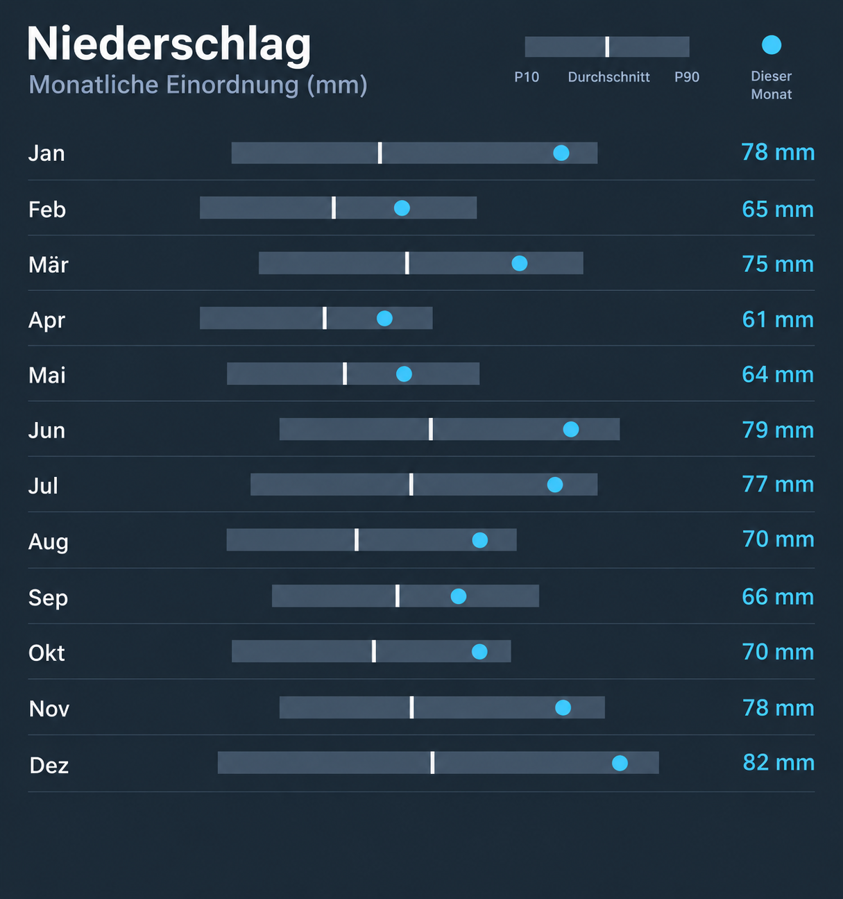

# NHZ Climate Range Card

Home Assistant dashboard card distributed through a public GitHub repository. Install it as a HACS custom Dashboard repository; it is not listed in the HACS default catalog. The card contains no hostnames, tokens, or site credentials.

Current feature version: **0.9.2**.



Maintainers must publish every deployable version with the **Publish HACS
release** GitHub Actions workflow. HACS deployments must use that published
release; commits from the default branch, direct file copies and changed
content behind an existing release URL are not supported deployment methods.

## Dependencies and installation

- The NHZ Climate HA integration and its climate-profile entities.
- `apexcharts-card` for the general-variable charts.
- Add `nhzgh/nhz-climate-range-card` in HACS → Custom repositories → Dashboard, then install it.
- Register `/hacsfiles/nhz-climate-range-card/nhz-climate-range-card.js` as a JavaScript module if HACS does not do so automatically.

Use `type: custom:nhz-climate-range-card`. Each graph needs a title, explanation, profile entity, and compatible source entity. The declarative `display_mode` selects the visualization semantics: `general`, `cumulative`, or `cumulative_year`. The card never reads the API token directly.

```yaml
type: custom:nhz-climate-range-card
default_range: 30d
graphs:
  - title: Regen
    explanation: flüssiger Niederschlag
    variable: rain
    profile_entity: sensor.example_rain_climate_profile
    source_entity: sensor.example_rain_rate
    monthly_comparison_entity: sensor.nhz_climate_example_rain_monthly_comparison
    display_mode: cumulative_year
```

`cumulative_year` uses a cumulative IST-versus-mean curve for 7, 30, and 90 days. The rolling 365-day view is a sequence of local-month rows: the P10–P90 band, white mean marker, and IST point share a full-width bar; its mouseover carries P10/P90, coverage and source. The compact month label contains IST, historical mean and delta. A year always means 365 rolling local days, so edge months are partial.

`cumulative` uses the same cumulative curve for all non-today ranges, while `general` uses the normal variable chart. Snow can use either cumulative mode without a special variable name. For every cumulative mode, **Heute** deliberately displays a note: seven days are the smallest meaningful comparison window. The `rain` actual can combine a configured local gauge, ERA5, and archived ICON hour by hour. For all-phase `precipitation`, the integration replaces only the modelled liquid component with that gauge and retains the modelled solid-water equivalent. Incomplete coverage is marked, not silently interpreted as zero.

`precipitation_view` remains a compatibility alias for existing dashboards, but new configurations should use `display_mode`.
